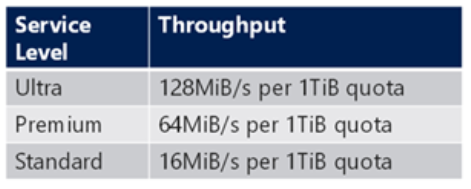
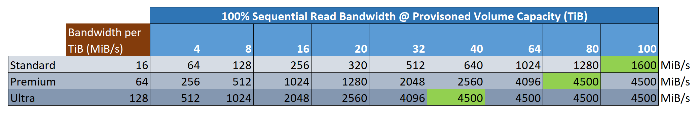
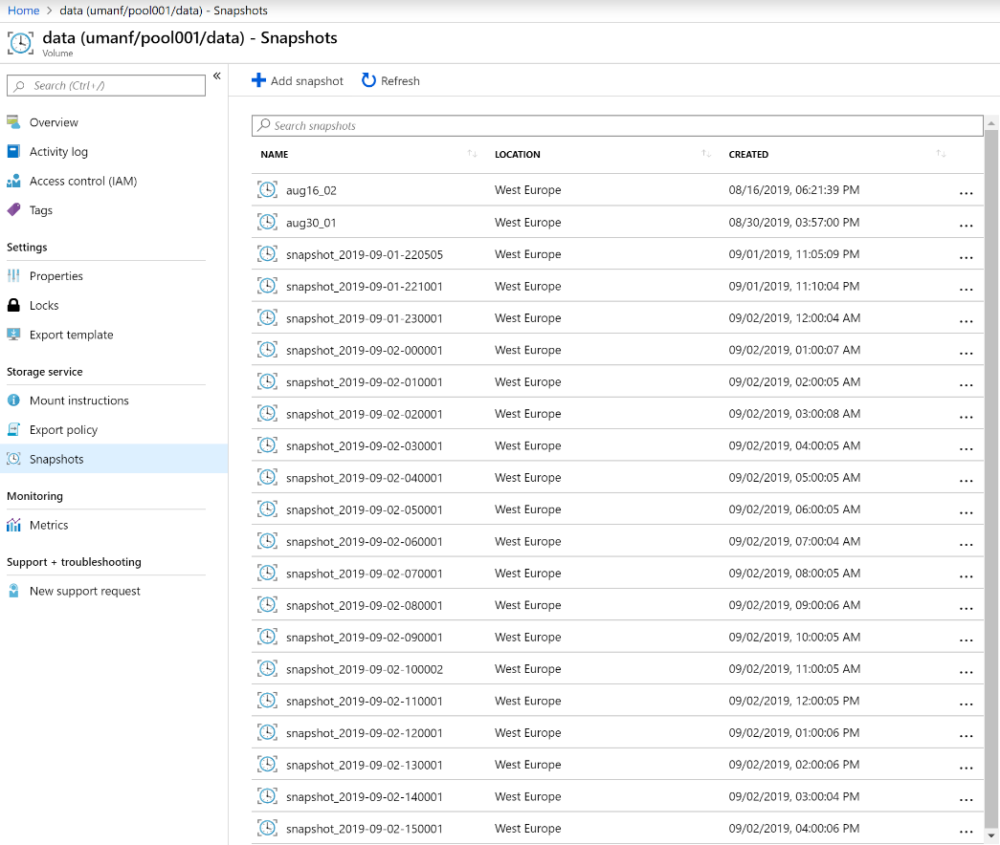
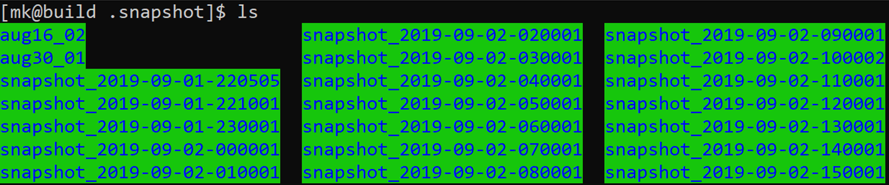

# Azure NetApp Files Utilities / anf_utils

<a href="https://docs.microsoft.com/en-us/azure/azure-netapp-files/">Azure NetApp Files</a> (ANF) is a low-latency storage solution for storing your applications, libraries, code & configuration when running HPC jobs in Azure. With throughput up to 4.5GiB/s possible per volume, ANF actually performs well enough to use as the primary storage / scratch area for input/output datasets in many cases as well, without necessarily needing to resort to a parallel filesystem. 

These bash scripts are provided to interact with ANF from your linux cluster or build hosts. You will need to have the Azure CLI installed, have run "az login" and selected the correct default subscription in which your Azure NetApp Files / ANF appliance is installed. 

## 1. anf_resize.sh

<a href=anf_resize.sh>anf_resize.sh</a> is a standalone utility that allows you to resize a volume and it's containing capacity pool up or down on demand. Script utilization:
```
./anf_resize.sh

Usage: anf_resize.sh [--account-name,-a <ANF account name>]
                     [--resource-group,-r <resource group>]
                     [--pool-name,-p <capacity pool name>]
                     [--volume-name,-v <volume name>]
                     [--pool-size <pool size in TiB>]
                     [--vol-size <volume size in TiB>]

eg: resize up for max throughput on ultra tier:
anf_resize.sh -r mygrp -a myanf -p mypool001 -v myvol001 --pool-size 40 --vol-size 40

eg: resize back down for cost optimization:
anf_resize.sh -r mygrp -a myanf -p mypool001 -v myvol001 --pool-size 4 --vol-size 4
```

In some HPC scenarios it is useful to be able to scale up the available bandwidth on the storage tier while a benchmark or job is running, and then reduce the capacity & bandwidth again when the job/benchmark is finished, thus keeping costs to a minimum. The API calls and resize operations complete quickly enough that this script is practical to use as part of a pre- & post- task when running HPC jobs. If you prefer to do it by hand you can do so <a href="https://docs.microsoft.com/en-us/azure/azure-netapp-files/azure-netapp-files-resize-capacity-pools-or-volumes">via the Azure Portal</a>.

The following table illustrates how ANF scales i/o capacity with the size of the size of the volumes on each storage service Tier. More information is available on <a href="https://docs.microsoft.com/en-us/azure/azure-netapp-files/azure-netapp-files-service-levels#throughput-limits">this page</a>.
<br>

<br>

The cells highlighted in green below indicate at which capacity the maximum (sequential read) bandwidth can be reached per service tier type: 
<br>
 
<br>

### Example Use Case
Ultra tier volumes will grow throughput at 128MiB/s with every 1TiB in capacity up to a peak of 4.5GiB/s at around 40TiB. If you therefore have under 4TiB of data, it makes sense to grow up to 40TiB to maximize performance, and then reduce to 4TiB for steady state at lower cost. 

### Step 1: Resize Ultra Tier Volume to 40TiB to Optimize Performance

Before you run your job/benchmark, increase the Ultra tier bandwidth as follows: 


### Step 2: Resize Back Down to 4TiB to Optimize Costs

Once you've run your job/benchmark, you can resize back down as follows: 


## 2. anf_snapshot.sh

NetApp Data ONTAP systems come with a key feature known as Snapshots. Data ONTAP snapshots are extremely space efficient (taking almost zero space at the time of creation) and are created instantaneously since no data is moved at the time of creation. In the Data ONTAP WAFL filesystem blocks are not overwritten until they are recycled, and thus point-in-time copies using pointer based references are an extremely space efficient and performance neutral methodology to create backups. 

NetApp snapshots are normally controlled and initiated using a built in schedule, and thus protection is automated from the time of volume creation. At the time of writing Azure NetApp Files does not yet support this automated functionality. However, there are options to initialize the creation and cycling of snapshot backups. 

* Option 1: Creation & Deletion of Snapshots via the Azure Portal. 
* Option 2: Azure Functions - https://github.com/kirkryan/anfScheduler 
* Option 3: Client side script “anf_snapshot.sh” - https://github.com/mkiernan/anf_utils

The first option is good for manual backups when major changes are about to happen to the filesystem, or you want to be sure you have a recovery point in place after completing a complex piece of work. The second option is great for completely automating snapshot creations even when all of your server infrastructure is offline. The 3rd option provides a simple utility for Linux/HPC administrators to use a bash script launched from an hourly cron script running on a persistent linux node as follows: 
0 * * * * /hpc/anf_utils/anf_snapshot.sh -a umanf -r umgrp -p pool001 -v data -l westeurope
This will create a snapshot on the desired ANF account “umanf” in volume “data”, capacity pool “pool001” once per hour, and will retain and purge snapshots according to a default predetermined schedule. The resulting snapshots are shown in the diagram below. Note that you can still create snapshots manually via the portal (or Azure CLI or API) while the schedule snapshots are running. 

 

If you or your users have inadvertently destroyed or corrupted data on the filesystem, it is then perfectly straightforward to restore files from the snapshots by one of two methods: 
Restore Method 1: “.snapshot” folder. 
A snapshot represents a complete (and consistent) point-in-time view of the entire filesystem as it was a the moment the snapshot was taken. Thus using the default schedule of hourly snapshot events, we should see a complete filesystem for each hour. Azure NetApp Files by default exposes the snapshot views through the “.snapshot” folder in the root of the filesystem tree. You can see an example here: 



It is therefore simply a matter of entering the folder for the relevant snapshot, finding the lost/corrupted files and copying them back into the live filesystem folder using the Linux “cp” command. This makes restores available for every end user as a self-service capability, without having to restort to backups and helpdesk tickets. 


