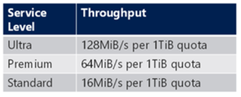
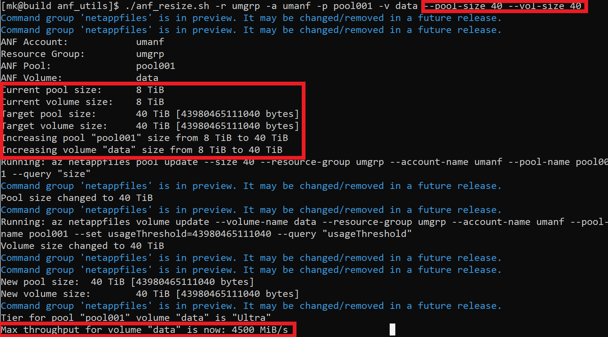
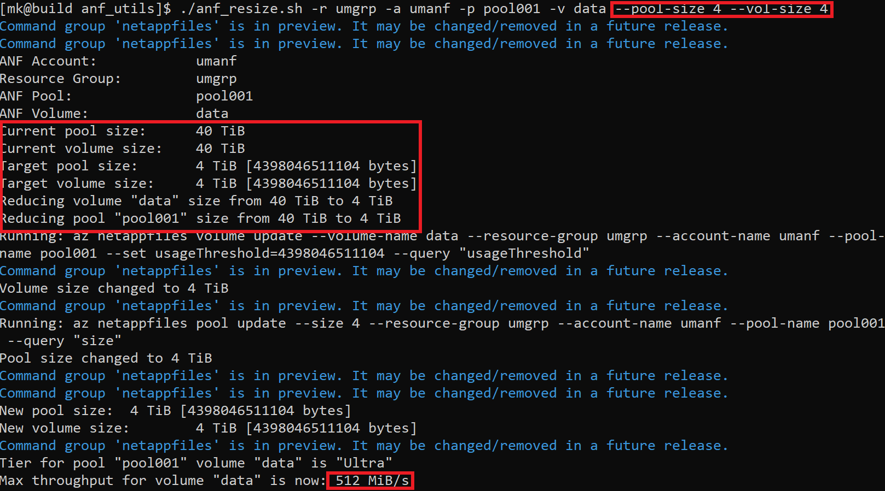

# Azure NetApp Files Utilities / anf_utils

<a href="https://docs.microsoft.com/en-us/azure/azure-netapp-files/">Azure NetApp Files</a> (ANF) is the perfect low-latency storage solution for storing your applications, libraries, code & configuration when running HPC jobs in Azure. With throughput up to 4.5GiB/s possible per volume, ANF actually performs well enough to use as the primary storage / scratch area for input/output datasets in many cases as well, without necessarily needing to resort to a parallel filesystem. 

These bash scripts are provided to interact with ANF from your linux cluster or build hosts. You will need to have the Azure CLI installed, have run "az login" and selected the correct default subscription in which your Azure NetApp Files / ANF appliance is installed. 

## 1. anf_resize.sh

The ANF service scales the total throughput cap relative to the capacity of a volume. Check out how the limits scale with capacity on <a href="https://docs.microsoft.com/en-us/azure/azure-netapp-files/azure-netapp-files-service-levels#throughput-limits">this page</a>. This table summarizes: 
 

 

In some HPC scenarios such as benchmarking, it is interesting to be able to scale up the available bandwidth on the storage tier to remove any potential i/o bottlenecks while a benchmark or job is running, and then reduce the capacity & bandwidth again when the job/benchmark is finished, thus keeping costs to a minimum. 

<a href=anf_resize.sh>anf_resize.sh</a> is a standalone utility that allows you to do this by resizing a volume and it's containing capacity pool up or down on demand. The API calls and resize operations complete quickly enough to mean that this functionality is practical to use as part of a pre- & post- task when running HPC jobs. 

Utilization:

./anf_resize.sh

Usage: anf_resize.sh [--account-name,-a <ANF account name>]
                     [--resource-group,-r <resource group>]
                     [--pool-name,-p <capacity pool name>]
                     [--volume-name,-v <volume name>]
                     [--pool-size <pool size in TiB>]
                     [--vol-size <volume size in TiB>]

eg: anf_resize.sh -r mygrp -a myanf -p mypool001 -v myvol001 --pool-size 16 --vol-size 16

### Example Use Case
Ultra tier volumes will grow throughput at 128MiB/s with every 1TiB in capacity up to a peak of 4.5GiB/s at around 40TiB. If you therefore have under 4TiB of data, it makes sense to grow up to 40TiB to maximize performance, and then reduce to 4TiB for steady state at lower cost. 

### Step 1: Resize Ultra Tier Volume to 40TiB to Optimize Performance

Before you run your job/benchmark, increase the Ultra tier bandwidth as follows: 

### Step 2: Resize Back Down to 4TiB to Optimize Costs

Once you've run your job/benchmark, you can resize back down as follows: 

## 2. anf_snapshot.sh

One of the key foundational features of NetApp is space efficient, instantaneous snapshots - meaning continuous protection for your data. Physical NetApp systems come with snapshots enabled and automated to run on a schedule out-of-the-box. Unfortunately the traditional NetApp WAFL scheduled snapshot functionality is not there yet with ANF [coming soon I'm assured!]. In the meantime you can create a snapshot interactively from the Azure Portal or the CLI, but there are no utilities in there yet to help you automate initiation of snapshots and manage the snapshot cycle. This script provides that. 

[Coming shortly - still testing this one]

